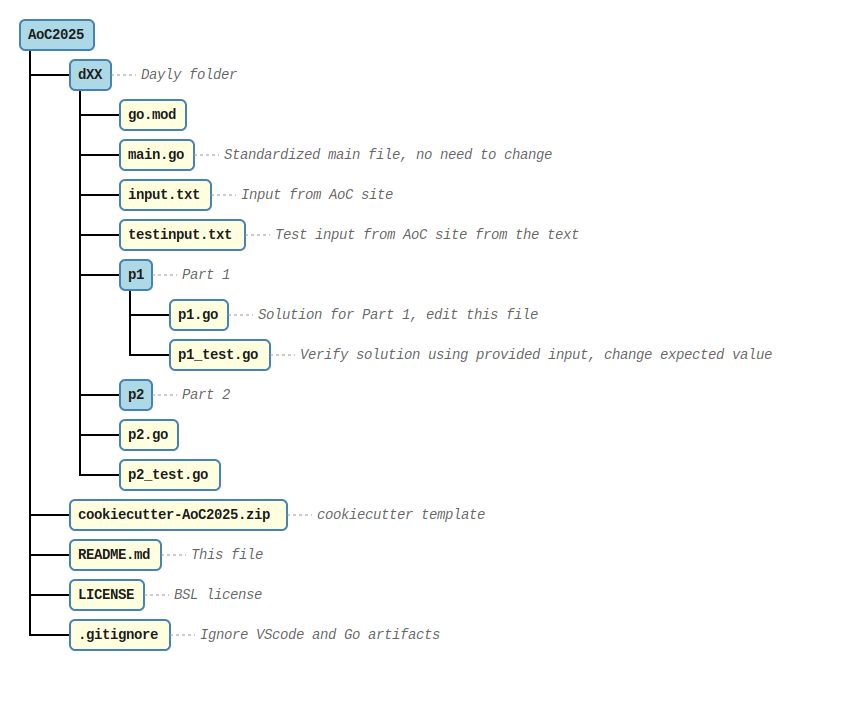

# Advent of Code 2025 - Go Solutions

   

This repository contains my solutions for [Advent of Code 2025](https://adventofcode.com/2025) implemented in Go.

## Overview

Advent of Code is an annual event featuring a series of coding challenges released daily from December 1st through December 12th. Each day presents two related problems of increasing difficulty.

## Project Structure



Each day (`dXX`) is organized as a separate module containing:

- **main.go**: Entry point that reads input and calls both part solvers
- **input.txt**: The actual puzzle input
- **testinput.txt**: Sample input for testing (typically from problem description)
- **p1/**: Part 1 solution with tests
- **p2/**: Part 2 solution with tests

## Days Completed

- [x] Day 01 - Secret Entrance
- [x] Day 02 - Gift Shop
- [x] Day 03 - Lobby
- [ ] Day 04 - ???
- [ ] Day 05 - ???
- [ ] Day 06 - ???
- [ ] Day 07 - ???
- [ ] Day 08 - ???
- [ ] Day 09 - ???
- [ ] Day 10 - ???
- [ ] Day 11 - ???
- [ ] Day 12 - ???

## Scaffolding new day

Use provided cookiecutter template:

```bash
cookiecutter --no-input cookiecutter-AoC2025.zip day_number=XX
```

## Building & Running

### Run a specific day's solution

```bash
cd dXX
go run main.go
```

### Run tests for a specific part

```bash
cd dXX/p1
go test -v
```

Or for part 2:

```bash
cd dXX/p2
go test -v
```

### Run all tests

```bash
go test ./...
```

## Code Style

- Follows [Effective Go](https://golang.org/doc/effective_go) conventions
- Clear, readable variable and function names
- Comprehensive test coverage for each solution
- Minimal external dependencies (mostly standard library)

## Tools & Environment

- **Language**: Go 1.25+
- **Testing**: Go's built-in `testing` package
- **IDE**: VS Code, Helix

## Notes

This is a learning exercise focusing on:

- Problem-solving and algorithmic thinking
- Go language idioms and best practices
- Writing efficient, clean code under time constraints

## Resources

- [Advent of Code 2025](https://adventofcode.com/2025)
- [Effective Go](https://golang.org/doc/effective_go)
- [Go Documentation](https://golang.org/doc/)

---

**Start Date**: December 1, 2025  
**Language**: Go  
**Status**: In Progress
